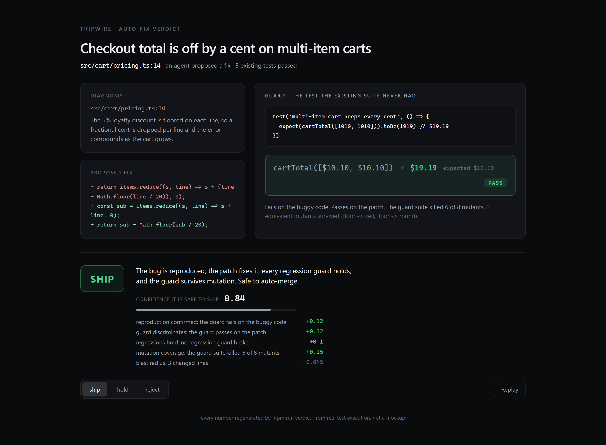
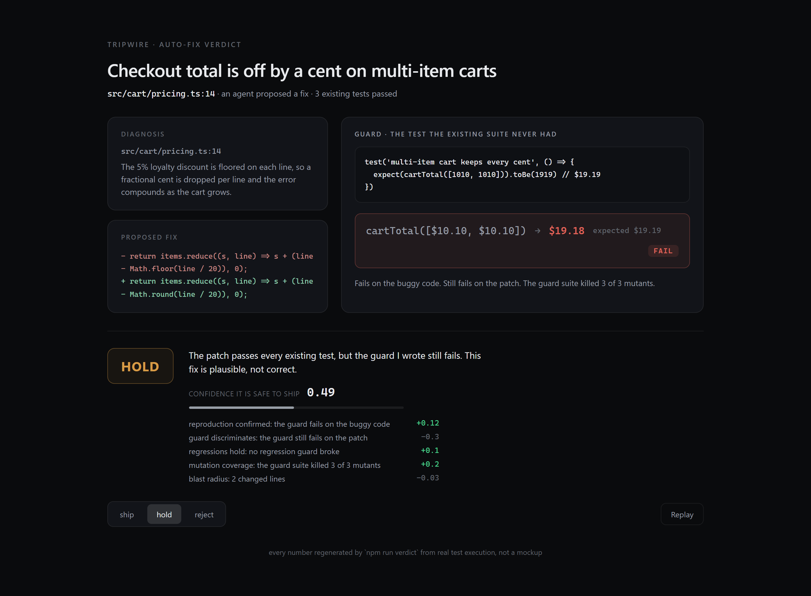

# Tripwire

A safe-to-ship gate for autonomous code fixes. It does not trust the existing
test suite, because a patch that passes every test can still be wrong. Instead it
manufactures the discriminating test the suite never had, runs it, and decides
**ship / hold / reject** on a confidence that is honest about when it does not know.

One screen, one decision, one proof:



The knockout is the same card on a patch that passes every existing test but is
still wrong. The guard Tripwire wrote catches it, so the decision is HOLD:



## Why

When an agent fixes a production bug and auto-merges the patch, "the tests pass"
is the one signal that cannot catch the failure that matters: a fix that is
*plausible but not correct*. Independent re-evaluation of SWE-bench found that
**around 48% of issues marked "resolved" passed only because the test suite was
too weak to catch the regression**, and true resolution roughly halves once
proper test coverage is enforced (ICSE 2026, *Are Solved Issues in SWE-bench
Really Solved Correctly?*, arXiv:2503.15223). Every shipping tool stops short of
auto-merge for exactly this reason: Sentry Seer drafts a PR but does not merge,
Datadog Bits needs human approval, GitHub Copilot Autofix only suggests. The gate
is the missing piece, and it is the place a small team can win on trust rather
than on data or model scale.

## What it does

For a candidate patch, Tripwire:

1. Runs the existing suite. On the seeded bug it stays green, which is the trap.
2. Manufactures a **proof test** and proves it by execution: it must fail on the
   buggy code (red on the bug) and pass on the patch (green on the fix). A test
   that is green on both is discarded as non-discriminating.
3. Runs **regression guards**: behaviour that must not break.
4. **Mutation-tests** the patch with hand-picked mutants and reports the kill
   rate, so a guard that is only vacuously green is exposed. Equivalent mutants
   that survive are reported honestly.
5. Routes **SHIP / HOLD / REJECT**. HOLD ("I do not know enough to auto-merge")
   is a first-class outcome, not a failure.

Three real scenarios, one cart-pricing bug, three candidate patches:

| Scenario | Decision | What the execution shows |
|---|---|---|
| `ship`   | **SHIP** 0.84 | guard red on the bug, green on the fix; regressions hold; 6 of 8 mutants killed |
| `hold`   | **HOLD** 0.49 | passes all three existing tests, but the guard still fails: plausible, not correct |
| `reject` | **REJECT** 0.42 | fixes the headline cart, but a regression guard breaks: it harms bulk carts |

## What is real and what is seeded

This is a verifier, and it is honest about its seam:

- **Real:** the buggy code, the candidate patches, the guard test, the regression
  guards, and the mutants are all executed. The red/green you see, the mutation
  kill rate, and the decision all come out of `npm run verdict` actually running
  code. The integer-cent math is exact, so no verdict hinges on float noise.
- **Seeded:** the bug, the patches, and the guard are committed, not generated by
  a model at view time. `npm run verdict` **re-proves** them by re-running the
  real tests and mutations; it does not regenerate them. The deployed page renders
  the committed JSON and never runs code in the browser.
- **The confidence is a mechanism, not a statistic.** It is composed from the
  signals above (reproduction confirmed, guard discriminates, regressions hold,
  mutation kill-rate, blast radius) and shown factor by factor. It is not a
  calibrated population probability, and it is capped below 1.0 on purpose: a
  verifier with surviving mutants should never claim certainty.

## Run it

```bash
npm install
npm run verdict        # re-run the real tests + mutations, regenerate verdicts/*.json
npm run verdict:check  # same, but fail if any decision drifts
npm run dev            # the verdict card at http://localhost:3000
npm run build          # static export (prebuild re-runs the verdicts first)
```

Clone it, change the bug in `engine/scenarios.ts`, run `npm run verdict`, and
watch the decision move. That is the whole point: the verdict is falsifiable.

## Layout

```
engine/
  verify.ts       the pipeline: execute tests + mutations, decide ship/hold/reject
  scenarios.ts    one bug, three candidate patches, the weak suite, the guard, the mutants
  cli.ts          npm run verdict: re-prove every scenario, write verdicts/*.json
verdicts/         committed JSON the UI renders (regenerated, never hand-written)
app/              the Next.js verdict card (one screen, one hero interaction)
```

Built by Lawrence Wolters. The palette and restraint follow a minimal, single-
interaction design idiom. MIT licensed.
